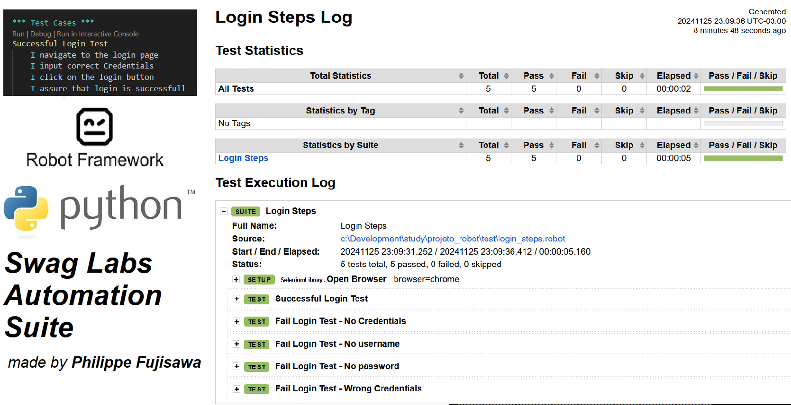

# Projeto Robot Framework



## 📜 Descrição do Projeto

Este repositório contém um projeto de automação de testes desenvolvido com **Robot Framework**, projetado para simplificar e aprimorar os processos de testes de software. O projeto demonstra experiência em criar scripts de teste modulares, reutilizáveis e em aproveitar as capacidades do Robot Framework para testes de web.

O objetivo é demonstrar como a automação pode melhorar a eficiência dos testes e garantir a qualidade do software, destacando as melhores práticas e metodologias robustas em automação de QA.

---

## 📂 Funcionalidades

- 🤖 **Testes Automatizados com Robot Framework**: Suporte para testes de web.
- 🔧 **Framework Baseado em Palavras-Chave (Keyword-Driven)**: Estrutura modular e reutilizável para facilitar o desenvolvimento de casos de teste.
- 📊 **Relatórios Detalhados**: Geração de logs e relatórios abrangentes para os testes executados.
- 🌐 **Testes Multi-Navegador**: Compatibilidade com diversos navegadores web para maior cobertura.
- 🔌 **Fácil Integração**: Integração com pipelines CI/CD.

---

## 🚀 Como Começar

### Pré-requisitos

Certifique-se de ter as seguintes ferramentas instaladas:

- **Python** (v3.7 ou superior)
- **Robot Framework** (última versão)
- **Drivers de Navegadores** (ex.: ChromeDriver, GeckoDriver para Selenium)
- **pip** (Gerenciador de pacotes Python)

---

### Instalação

1. Clone o repositório:
```bash
git clone https://github.com/philfujisawa/projeto_robot.git
cd projeto_robot
```
2. Instale as dependências:

```bash
Copiar código
pip install -r requirements.txt
```

3. Execute os testes:

```bash
robot tests/
```

## 🧪 How It Works
**1. Configuração**: O Robot Framework inicializa o ambiente de testes, incluindo conexões com navegadores.

**2. Execução dos Testes**: Executa os casos de teste definidos no diretório tests/.

**3. Relatórios**: Gera logs e relatórios detalhados para análise dos resultados dos testes.


Autor: [Phil Fujisawa](https://github.com/philfujisawa)
Sinta-se à vontade para se conectar comigo via [LinkedIn!](https://www.linkedin.com/in/philippefujisawa/)