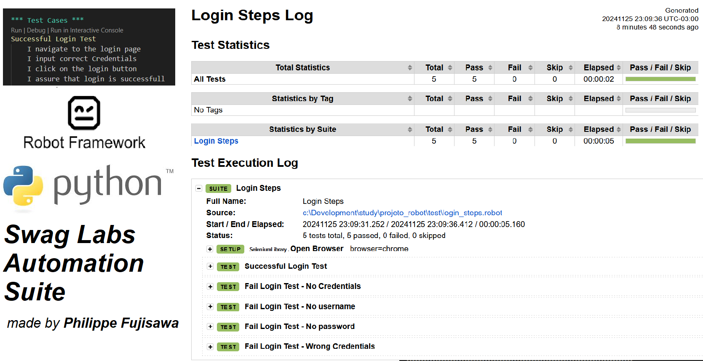

# Robot Framework Project



## 📜 Project Description

This repository contains a test automation project built with **Robot Framework**, designed to simplify and enhance software testing processes. The project showcases expertise in writing modular, reusable test scripts and leveraging Robot Framework's capabilities for web.

The objective is to demonstrate how automation can improve testing efficiency and ensure software quality, highlighting best practices and robust methodologies in QA automation.

**Para README em Português acessar no repositório o documento README-PTBR.md**

---

## 📂 Features

- 🤖 **Automated Testing with Robot Framework**: Web testing capabilities.
- 🔧 **Keyword-Driven Framework**: Modular and reusable test structure for streamlined test case development.
- 📊 **Detailed Reporting**: Generates comprehensive logs and reports for executed tests.
- 🌐 **Cross-Browser Testing**: Compatibility with various web browsers for broader test coverage.
- 🔌 **Easy Integration**: Seamless integration with CI/CD pipelines.

---

## 🚀 Getting Started

### Prerequisites

Ensure you have the following tools installed:

- **Python** (v3.7 or higher)
- **Robot Framework** (latest version)
- **Browser Drivers** (e.g., ChromeDriver, GeckoDriver for Selenium)
- **pip** (Python package installer)

---

### Installation

1. Clone the repository:
```bash
git clone https://github.com/philfujisawa/projeto_robot.git
cd projeto_robot
```
2. Install dependencies:

```bash
Copiar código
pip install -r requirements.txt
```

3. Run the tests:

```bash
robot tests/
```

## 🧪 How It Works
**1. Setup**: Robot Framework initializes the testing environment, including browser.

**2. Test Execution**: Executes test cases defined in the tests/ directory.

**3. Reporting**: Generates detailed logs and reports for all test cases to analyze results effectively.


Author: [Phil Fujisawa](https://github.com/philfujisawa)
Feel free to connect with me via [LinkedIn!](https://www.linkedin.com/in/philippefujisawa/)